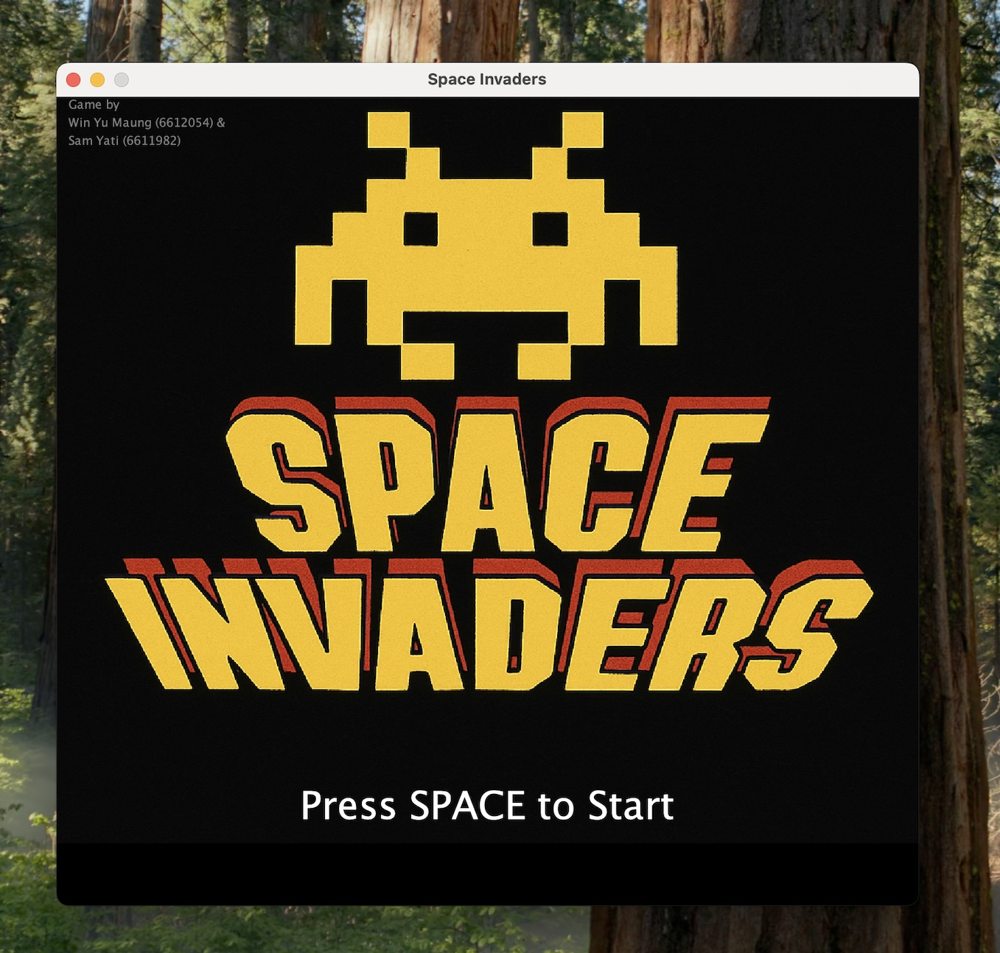
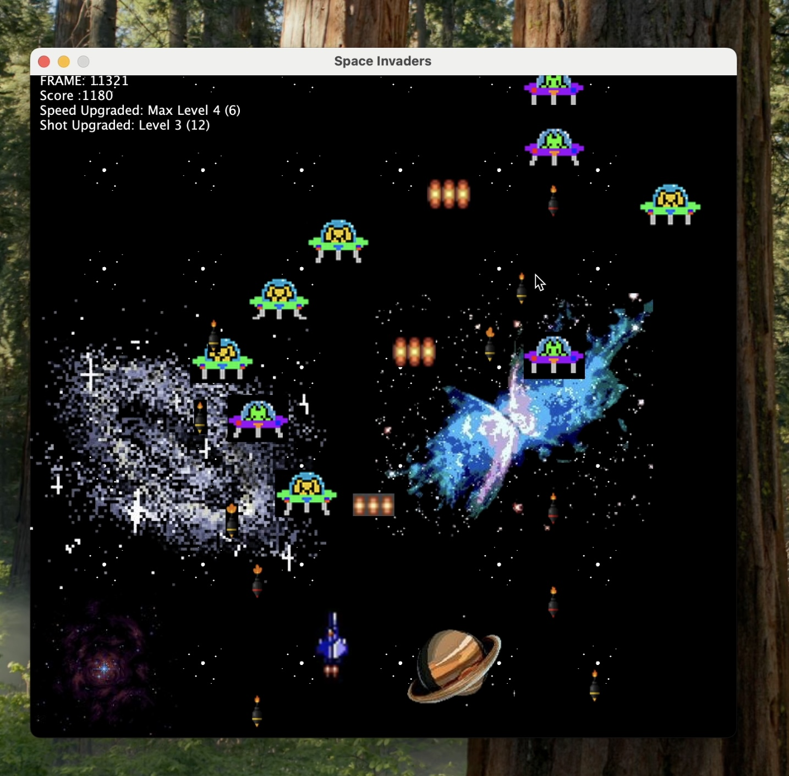
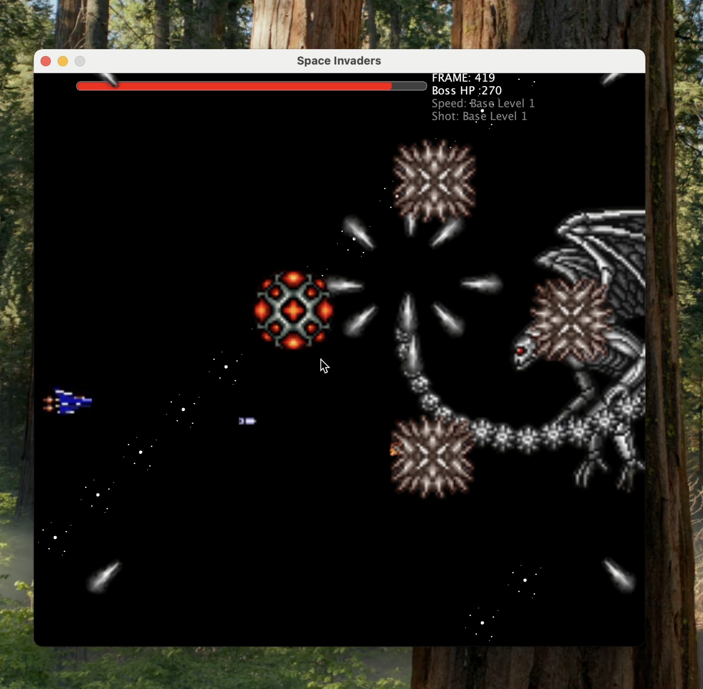

# 🚀 Project: Space Shooter Game

> 🎮 Inspired by *Life Force / Salamander*  
> Built from: [mchayapol/gdd-space-invaders-project](https://github.com/mchayapol/gdd-space-invaders-project)

---

# 👥 Team Members:
  - Win Yu Maung (6612054)
  - Sam Yati (6611982)

---

## 📌 Project Description

This project is a **side-scrolling shooter game** featuring classic gameplay mechanics. It is developed by extending the provided base code and includes fully animated sprites, stage scrolling, boss battles, and more.

---

## 🧾 Requirements Checklist

✅ Extended from base repo: `mchayapol/gdd-space-invaders-project`  
✅ Title scene includes team member names  
✅ Side-scrolling gameplay  
✅ Minimum 2 stages, each scrolls for ~5 minutes  
✅ Final stage includes a **Boss Fight**  
✅ CSV-based map loading  
✅ Minimum **2 enemy types**  
✅ Animated sprites (clipped)  
✅ Separate list for **enemy bombs**  
✅ **Power-ups:**
- Speed up (4 levels)
- Multi-shot (4 levels)

✅ **Dashboard UI includes:**
- Current score
- Speed level
- Shot upgrade level

---

## 📼 Game Play Demo

🎥 [Watch on YouTube](https://youtu.be/eWdNCxA10UA)

---

## 📸 Screenshots

### 🚀 Title Screen

### 👾 Stage 1 Gameplay

### 🧨 Boss Fight

---

## 📂 Source Code

🔗 [GitHub Repository](https://github.com/Kusk24/Game_Design_Development_Project1.git)

---

## 👾 Gameplay Features

- Progressive difficulty scaling  
- Scroll-triggered enemy waves  
- Explosion effects and collision detection  
- Audio effects and soundtrack  
- Manual restart from Scene 1 after Game Over

---

## 🛠️ How to Run

1. Clone the repository
2. Open the project in your IDE
3. Run the `Main` class
4. Use Arrow keys to move, `Space` to shoot